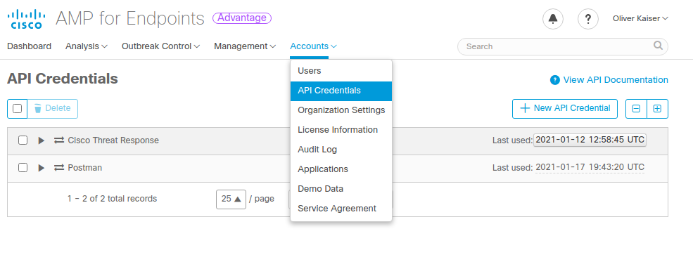
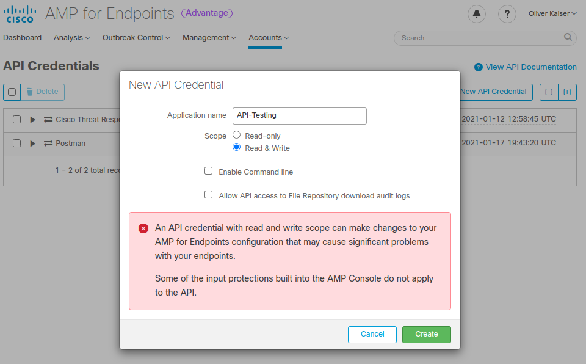

# Cisco Secure Endpoint (AMP4E)

This collection contains examples for Cisco Secure Endpoint REST API. It includes 52 examples for the various endpoint functions.

The following variables must be set to use the Postman collection:

| Name          | Description                   | Default                         |
| ------------- | ----------------------------- | ------------------------------- |
| api_endpoint  | URL to AMP4E Public Cloud API | https://api.eu.amp.cisco.com/v1 |
| api_client_id | API Client ID                 | None                            |
| api_key       | API Client Key                | None                            |

API Credentials can be created on the AMP4E console

Note: Depending on which API calls you want to test `Read & Write` permission might be required. If you only want to lookup data via API choose the least required privilege level `Read-only`

There are currently 3 options for the `api_endpoint` depending on region:

* [api.amp.cisco.com](https://api-docs.amp.cisco.com/api_versions?api_host=api.amp.cisco.com)
* [api.apjc.amp.cisco.com](https://api-docs.amp.cisco.com/api_versions?api_host=api.apjc.amp.cisco.com)
* [api.eu.amp.cisco.com](https://api-docs.amp.cisco.com/api_versions?api_host=api.eu.amp.cisco.com)

Documentation for the API can be found at https://api-docs.amp.cisco.com/

