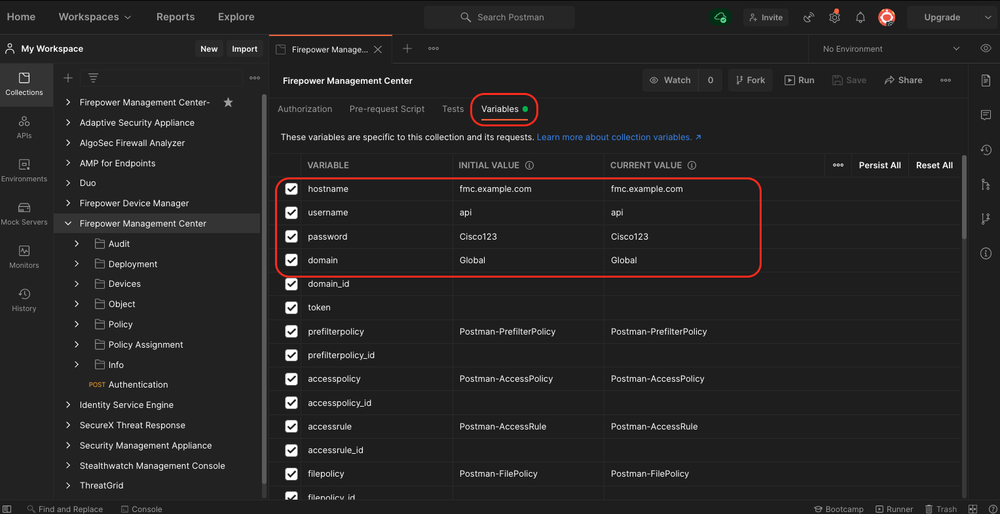
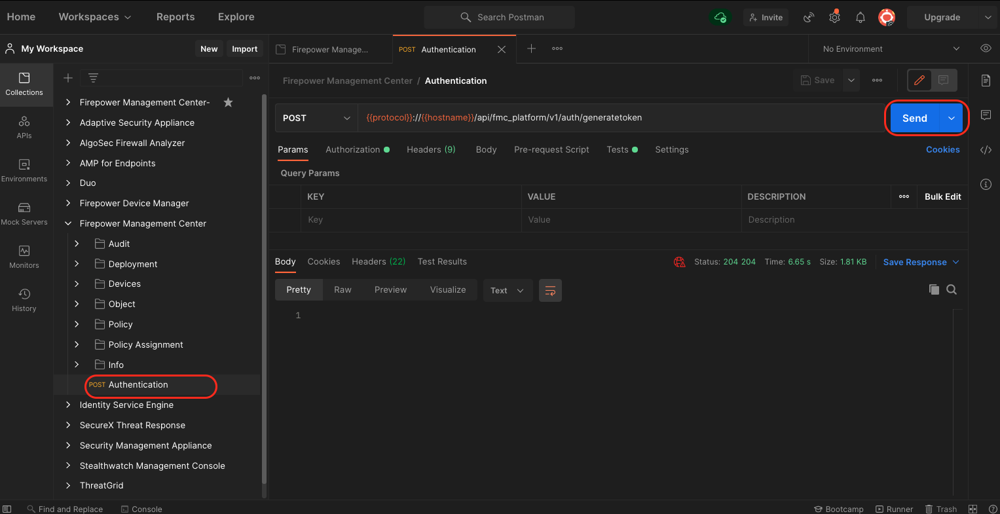
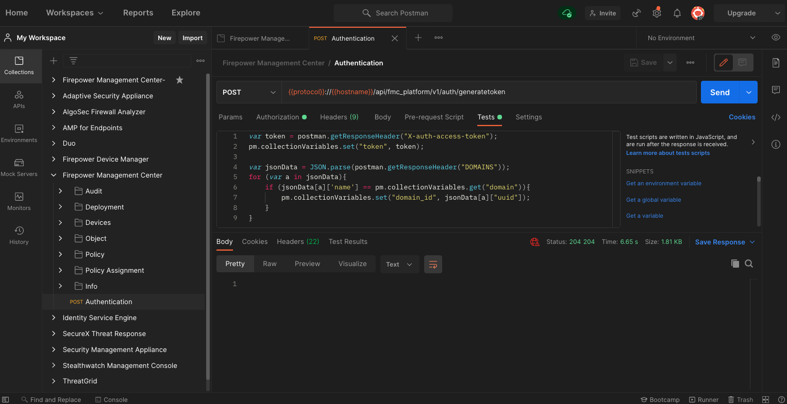

# Firepower Management Center

This collection contains examples for Cisco Secure Firewall (Firepower Management Center)  REST API 6.7.0. It includes 84 examples for the various api functions, including managing devices, objects and policies.

The following variables must be set to use the Postman collection:

| Name     | Description                                       | Mandatory | Default         |
| -------- | ------------------------------------------------- | --------- | --------------- |
| hostname | FQDN or ip address of Firepower Management Center | True      | fmc.example.com |
| username | Username                                          | True      | api             |
| password | Password                                          | True      | Cisco123        |
| domain   | FMC Domain                                        | False     | Global          |

Note: It is recommended to use a dedicated api user, since a user can only be authenticated once!

Documentation for the API can be found at https://www.cisco.com/c/en/us/td/docs/security/firepower/670/api/REST/firepower_management_center_rest_api_quick_start_guide_670.html

## Usage

After importing the postman collection you will need to edit the collection variables with the correct values for your environment:

Before you can test the different api calls you will need to authenticate to FMC. An authorization token will be generated and set within the collection variables of Postman to authenticate all subsequent api calls

For some operations (like Authentication) you will see some code in the **Tests** section of the specific Postman request. Many api calls use UUIDs to reference resources. By using the code in the **Tests** section those UUIDs are automatically copied over to the collection variables. For example upon creating a new resource, the created resource will be returned by the **POST** operation. The code defined in **Tests** will parse the JSON response and set the resource UUID based on the returned response:

