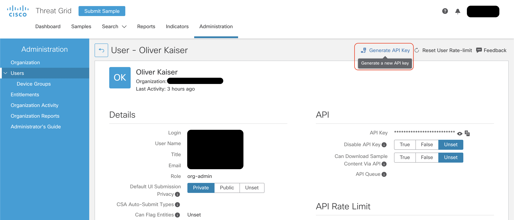

# Cisco Secure Malware Analytics (ThreatGrid)

This collection contains examples for Cisco Secure Malware Analytics REST API. It includes 585 examples for the various endpoint functions.

The following variables must be set to use the Postman collection:

| Name            | Description                                    | Mandatory | Default |
| --------------- | ---------------------------------------------- | --------- | ------- |
| api_endpoint    | URL to ThreatGrid Public Cloud API             | True      | None    |
| api_key         | API Client Key                                 | True      | None    |
| organization_id | Organization id used for org related api calls | False     | None    |
| username        | Username used for user related api calls       | False     | None    |

An API key can be generated from your users profile page 

Note: Depending on which API calls you want to test adequate permissions might be required.

There are currently 2 options for the `api_endpoint` depending on region:

- North American Cloud - https://panacea.threatgrid.com
- EU Cloud - https://panacea.threatgrid.eu

Documentation for the API can be found at https://panacea.threatgrid.eu/mask/doc-explorer when you are logged into ThreadGrid console.

